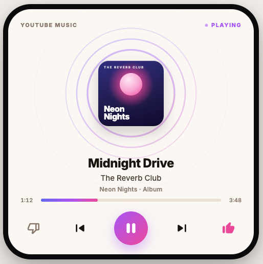

# YT Music Companion

A hardware companion device for **YouTube Music**. A Waveshare
ESP32-S3-Touch-AMOLED-2.16 board acts as a polished physical UI client — showing the
current track and sending commands (play/pause/skip/like/seek/volume).

<p align="center">
  
</p>

Audio playback runs on a host PC via the **ytmdesktop** app. A small cross-platform
bridge (Node.js, runs on macOS or Windows) normalizes ytmdesktop's state into the
board's view-model and serves it over Wi-Fi. No audio, decoding, TLS, or auth runs on
the board itself. See [bridge/WINDOWS-SETUP.md](bridge/WINDOWS-SETUP.md) for the
Windows host setup (recommended when the Mac is corporate-managed — its firewall
blocks the board's inbound connection).

## Architecture

```
ytmdesktop (Mac/Win)  ──►  bridge (Node.js)  ──Wi-Fi──►  ESP32-S3 board (UI)
  audio + state            normalize → VM               render + emit commands
```

- **Board** — pure UI client/controller. ESP32-S3 (BLE only, no A2DP), so it never
  touches audio.
- **Bridge** — talks to ytmdesktop's Companion Server (`localhost:9863`, Socket.IO +
  REST), pushes pre-resized 172×172 RGB565 cover art the board blits directly.
- **View-model** (`now_playing_vm_t`) — source-agnostic render layer; all
  YouTube-Music-specific terms live in the bridge.

## Layout

| Dir | Contents |
|-----|----------|
| `firmware/` | ESP-IDF firmware (vendor BSP, LVGL v9) for the board |
| `sim/` | Desktop LVGL simulator — run the UI without hardware |
| `ui/` | Shared UI: Now Playing screen, ring visualizer, styles, mock data |
| `design/` | HTML/UX design previews |
| `docs/` | Specs, overview, running instructions, handoff notes |
| `assets/` | Fonts and icon sources |
| `scripts/` | Icon generation, tooling |

## Stack

- **Hardware:** Waveshare ESP32-S3-Touch-AMOLED-2.16 (480×480, CO5300 QSPI)
- **Firmware:** ESP-IDF + vendor BSP, LVGL v9.5.0
- **Backend:** ytmdesktop Companion Server + cross-platform Node.js bridge (macOS or Windows)

## Status

Spec-and-first-slice phase. Current deliverable: Now Playing vertical slice with mock
data. See [docs/PROJECT-OVERVIEW.md](docs/PROJECT-OVERVIEW.md) for full status and
[docs/RUNNING.md](docs/RUNNING.md) to build and run.

## Quick start

Run the UI in the desktop simulator (no hardware needed — just CMake + SDL2):

```sh
brew install cmake sdl2
cd sim && cmake -B build && cmake --build build && ./build/ytm_sim
```

See [sim/README.md](sim/README.md) and [firmware/README.md](firmware/README.md) for
details.
